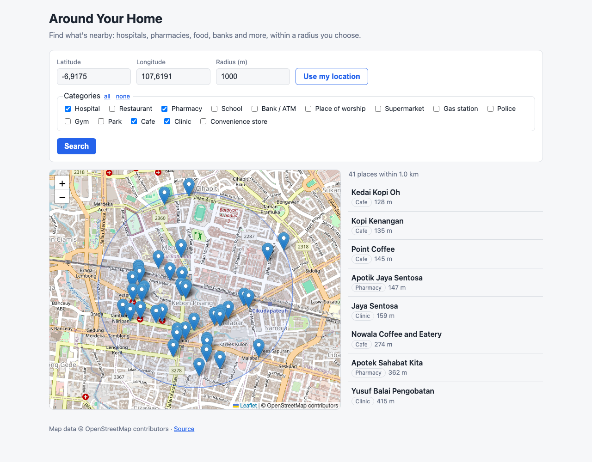
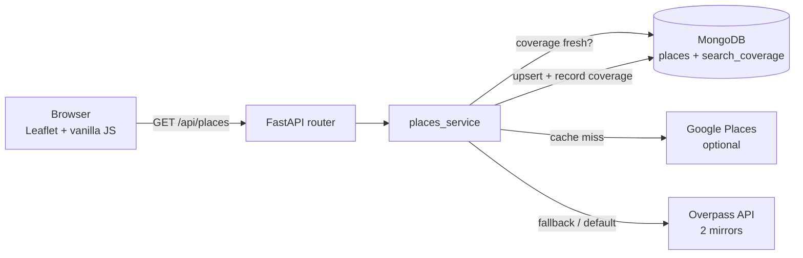

# Around Your Home

[](https://github.com/convyusboy/aroundyourhome/actions/workflows/ci.yml)


Give it a coordinate and a radius; it finds nearby hospitals, restaurants,
pharmacies, schools, banks/ATMs, places of worship, supermarkets, gas
stations, police stations, gyms, parks, cafes, clinics and convenience
stores, then shows them on a map and in a list sorted by distance.

Results are cached in MongoDB, so repeating a search is instant and doesn't
hit the upstream data provider again.



Searches are shareable links, e.g. `/?lat=-6.9175&lng=107.6191&radius=1000&categories=cafe,clinic`.

## Features

- **Search by any coordinate** or the browser's geolocation, with a 100 m to 10 km radius.
- **14 categories**, selectable individually.
- **Interactive map** (Leaflet): radius circle, markers with popups, click a result to fly to it.
- **Two data sources**: Google Places API (New) when a key is configured, otherwise
  OpenStreetMap via the Overpass API (free, no key, no card).
- **Smart caching**: a search is served from MongoDB when a previous search already
  *covered* the requested circle for that category and is younger than the TTL.
- **Graceful degradation**: if the upstream provider is down, you still get cached
  results, flagged `partial: true` and surfaced in the UI.

## Architecture



| Path | Responsibility |
|---|---|
| `app/routers/places.py` | Request validation (lat/lng, radius bounds, categories) |
| `app/services/places_service.py` | Orchestration: coverage check, provider choice, fallback, distance sort |
| `app/providers/` | `google_places.py` and `osm_overpass.py`, both normalise to `NormalizedPlace` |
| `app/db.py` | Upserts, 2dsphere index, coverage records, radius queries |
| `frontend/` | Static page served by FastAPI (no build step) |

## Design notes

These came from running the app against the real services, not just mocks:

- **Coverage records, not just cached places.** Caching "places near X" isn't enough:
  an empty result is also an answer. Each fetch stores a `(category, center, radius)`
  record, and a later request is "fresh" if a recorded circle *contains* it. Partially
  overlapping history is treated as a miss, which never under-fetches.
- **One batched Overpass request.** I benchmarked one request per category against a
  single batched query: ~279 s vs 4.4 s in the same session. Public Overpass servers
  are rate-limited, so splitting requests makes slow periods worse.
- **Nodes, ways and relations.** The first version queried only nodes and silently missed
  buildings and areas. In a dense Jakarta search, places of worship went from 5 to 116 once
  ways were included. IDs are stored as `way/123` because OSM ids are only unique per type.
- **Mirror fallback.** The public Overpass instance intermittently returns 504, and now
  rejects the default `python-httpx` User-Agent with 406. The client identifies itself and
  rotates across mirrors on 429/5xx/network errors.
- **Timeouts matched to the server's budget.** The HTTP client timeout (30 s) must exceed
  the query's own `[timeout:25]`, otherwise successful slow responses are aborted client-side.
- Full history of decisions and deviations is in
  [`docs/superpowers/plans/`](docs/superpowers/plans/2026-09-02-around-your-home.md);
  the original spec is [`docs/PRD.md`](docs/PRD.md).

## Run locally

Requires Docker.

    cp .env.example .env
    docker-compose up --build

Open http://localhost:8000/. No API key is needed: without `GOOGLE_PLACES_API_KEY` the
app uses OpenStreetMap. The first search in a new area can take several seconds while
Overpass responds; repeats come from the cache.

### Configuration

| Variable | Default | Meaning |
|---|---|---|
| `MONGO_URI` | `mongodb://localhost:27017` | Set to `mongodb://mongo:27017` by docker-compose |
| `GOOGLE_PLACES_API_KEY` | *(unset)* | Optional. Enables Google Places as primary source |
| `CACHE_TTL_DAYS` | `14` | How long a cached search counts as fresh |
| `DEFAULT_RADIUS_M` | `1500` | Radius used when the request omits one |

## API

`GET /api/places?lat=-6.2&lng=106.8&radius=1500&categories=hospital,pharmacy`

`categories` is optional (defaults to all). Invalid coordinates, a radius outside
100 to 10000 m, or unknown categories return `400`.

```json
{
  "query": {"lat": -6.2, "lng": 106.8, "radius": 1500, "categories": ["pharmacy"]},
  "partial": false,
  "results": [
    {
      "name": "Apotek Example",
      "category": "pharmacy",
      "distance_m": 212,
      "location": {"lat": -6.2013, "lng": 106.8009},
      "phone": "+62 21 555 1111",
      "opening_hours": "Mo-Su 08:00-21:00",
      "rating": null,
      "gojek_link": null,
      "source": "osm"
    }
  ]
}
```

`GET /health` returns `{"status": "ok", "mongo": true}`. Interactive API docs are at `/docs`.

## Tests

    python3 -m venv .venv
    source .venv/bin/activate
    pip install -r requirements-dev.txt
    pytest

The suite (50 tests) uses `mongomock` and `httpx.MockTransport`, so it needs no database
or network. CI runs it on every push.

## Limitations

- OpenStreetMap data has no ratings and sparse phone numbers; Google Places fills those in
  but requires a billing-enabled Google Cloud project.
- Google category mappings for `cafe`, `clinic` and `convenience_store` are unverified
  against Place Types (New), since development ran OSM-only.
- Personal, locally-run tool: no auth, no production deployment config.

## License

MIT, see [LICENSE](LICENSE).
